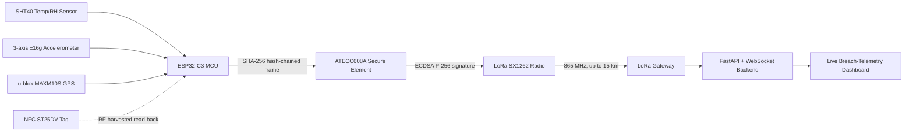
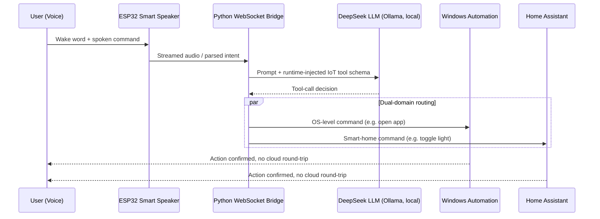
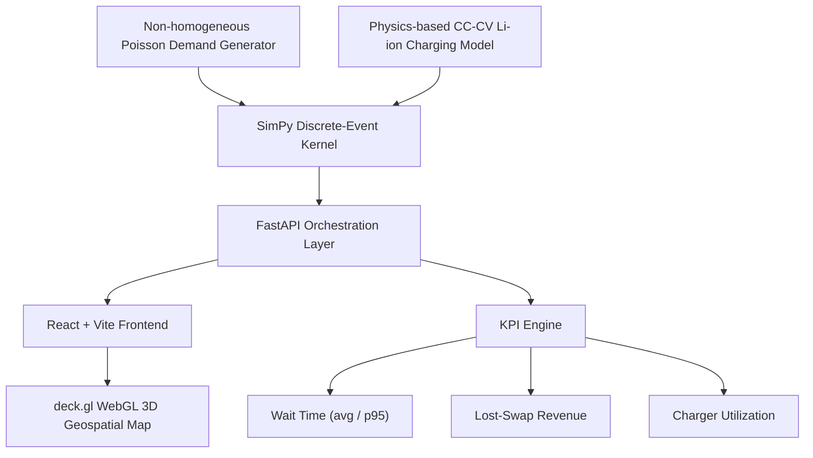

<!-- ======================================================================= -->
<!-- BOOT SEQUENCE & HEADER                                                  -->
<!-- ======================================================================= -->

  

  <a href="https://git.io/typing-svg">
    _BYPASSING_MAINFRAME_SECURITY...;>_FLASHING_CUSTOM_FIRMWARE_TO_ESP32...;>_ESTABLISHING_SECURE_LORA_UPLINK...;>_SYSTEM_ONLINE._WELCOME." alt="Terminal Boot" />
  </a>

 

  
  
  

 

 

<!-- ======================================================================= -->
<!-- HERO CIRCUIT BANNER — self-hosted, replaces the broken Pinterest gif    -->
<!-- ======================================================================= -->

  

 

 

<!-- ======================================================================= -->
<!-- EXECUTIVE SUMMARY TERMINAL                                              -->
<!-- ======================================================================= -->
<h2>📂 <code>/root/sys_info/executive_summary.log</code></h2>

<table>
  <tr>
    <td>
      <pre>
USER IDENTIFICATION RECORD
================================================================================
NAME          : Akshith Jakkaraju
CLEARANCE     : Third-year B.Tech IoT Engineering (GD Goenka University)
SPECIALIZATION: Embedded Systems, Hardware Security, Full-Stack Operations
STATUS        : Seeking high-impact roles in Embedded AI & IoT Security
================================================================================

[+] PROFILE LOADED:
I operate at the bleeding edge of cyber-physical systems. I do not just write
code; I build the physical hardware it runs on. From custom 2-layer PCB design,
power budgeting, and RF/wireless protocols to secure-element cryptography,
Python backends, and React dashboards, I control the entire tech stack.

[+] COMBAT RECORD:
Proven competitor in high-pressure national-level CTFs and hackathons.
Thrives in both solo-operations and leading specialized teams.
      </pre>
    </td>
  </tr>
</table>

 

 

<!-- ======================================================================= -->
<!-- AKSHITH-IC — the signature, unique piece                                -->
<!-- ======================================================================= -->
<h2 align="center">🧷 <code>/root/hardware_lab/pinout.diagram</code></h2>

<i>If I were a chip, this is my datasheet.</i>

  

 

 

<!-- ======================================================================= -->
<!-- DEEP TECH STACK MATRIX                                                  -->
<!-- ======================================================================= -->
<h2>⚙️ <code>/root/sys_arsenal/load_tech_matrix.exe</code></h2>

<table align="center" width="100%">
  <tr>
    <td width="50%" align="center" valign="top">
      <h3>🔌 HARDWARE & EMBEDDED</h3>
       
      
        
      

        <code>ESP32 & ESP32-C3</code> 
        <code>KiCad PCB Design</code> 
        <code>LoRa (SX1262)</code> 
        <code>MQTT Protocols</code> 
        <code>u-blox GPS Modules</code> 
        <code>SHT40 Temp/RH Sensors</code> 
        <code>Power Budgeting & Profiling</code> 
        <code>3D CAD Enclosures</code>
      

    </td>
    <td width="50%" align="center" valign="top">
      <h3>🛡️ CYBER DEFENSE & CRYPTO</h3>
       
      
        
      

        <code>ATECC608A Secure Elements</code> 
        <code>ECDSA P-256 Cryptography</code> 
        <code>SHA-256 Hash-Chaining</code> 
        <code>UFW Firewalls</code> 
        <code>Secure SSH Protocols</code> 
        <code>BFSI Threat Analysis</code> 
        <code>IoT Exploitation Vectors</code> 
        <code>Hardware Tamper Detection</code>
      

    </td>
  </tr>
  <tr>
    <td width="50%" align="center" valign="top">
      <h3>💻 BACKEND & WEB STACK</h3>
       
      
        
      

        <code>Python 3</code> 
        <code>FastAPI Backends</code> 
        <code>React + Vite Dashboards</code> 
        <code>WebSockets</code> 
        <code>deck.gl (WebGL 3D Vis)</code> 
        <code>SimPy (Discrete Event Sim)</code>
      

    </td>
    <td width="50%" align="center" valign="top">
      <h3>🤖 AI & INFRASTRUCTURE</h3>
       
      
        
      

        <code>C / C++ (Firmware)</code> 
        <code>Ollama (Local LLMs)</code> 
        <code>DeepSeek Integration</code> 
        <code>Home Assistant Automation</code> 
        <code>Windows OS Scripting</code> 
        <code>Git Version Control</code>
      

    </td>
  </tr>
</table>

 

 

<!-- ======================================================================= -->
<!-- HARDWARE R&D BENCH                                                      -->
<!-- ======================================================================= -->
<h2>🛠️ <code>/root/hardware_lab/bench_inventory.cfg</code></h2>

The workbench behind every deployment log below — this is what actually gets a board from schematic to field-hardened hardware.

<table align="center" width="100%">
  <tr>
    <th>INSTRUMENT</th>
    <th>SPEC CLASS</th>
    <th>PRIMARY USE ON MY BUILDS</th>
  </tr>
  <tr>
    <td>Digital Storage Oscilloscope</td>
    <td>100 MHz, 4-channel</td>
    <td>RF matching-network validation, LoRa Tx burst shape</td>
  </tr>
  <tr>
    <td>Logic Analyzer</td>
    <td>8-channel, 24 MHz</td>
    <td>SPI / I2C / UART bring-up for SHT40, GPS, secure element</td>
  </tr>
  <tr>
    <td>Bench Power Supply</td>
    <td>0–30V / 0–5A dual output</td>
    <td>µA-resolution deep-sleep current profiling</td>
  </tr>
  <tr>
    <td>Hot-Air Rework Station</td>
    <td>Adjustable 100–450°C</td>
    <td>QFN rework, ATECC608A / MCU reflow touch-ups</td>
  </tr>
  <tr>
    <td>Reflow Hot Plate</td>
    <td>PID-controlled ramp/soak/spike</td>
    <td>2-layer board assembly, fine-pitch component placement</td>
  </tr>
  <tr>
    <td>FDM 3D Printer</td>
    <td>0.1 mm layer height</td>
    <td>IP67 enclosure iterations, gasket fit-testing</td>
  </tr>
</table>

 

<h3>🧱 PCB Layer Stackup — CryoSentinel Mainboard</h3>

<pre>
PCB LAYER STACKUP :: 2-LAYER, 1.6mm FR4, 1oz COPPER
====================================================================
   ┌──────────────────────────────────────────────────────────┐
   │  L1 — TOP COPPER    RF feed + signal traces + pads        │
   ├──────────────────────────────────────────────────────────┤
   │        FR4 CORE  (1.6mm, εr ≈ 4.5)  — substrate            │
   ├──────────────────────────────────────────────────────────┤
   │  L2 — BOTTOM COPPER  solid GND pour + RF return path       │
   └──────────────────────────────────────────────────────────┘

   Trace impedance target ......... 50Ω single-ended (LoRa RF line)
   Coplanar waveguide gap .......... tuned per εr for 865 MHz match
   Via style ....................... 0.3mm drill / 0.6mm pad, tented
   Copper pour clearance ........... 0.3mm from RF trace edge
</pre>

 

 

<!-- ======================================================================= -->
<!-- SYSTEM TOPOLOGY / SCHEMATIC DIAGRAMS                                    -->
<!-- ======================================================================= -->
<h2>🧭 <code>/root/schematics/system_topology.mmd</code></h2>

Signal-chain and system-level diagrams for the three deployments below — how the sensors, secure element, radio, and software stack actually talk to each other.

<h3>🧊 CryoSentinel — Sensor-to-Cloud Signal Chain</h3>

<h3>🎙️ Project VENUS — Voice-to-Action Pipeline</h3>

<h3>🔋 DES-TWIN — Simulation & Visualization Architecture</h3>

 

 

<!-- ======================================================================= -->
<!-- MISSION CRITICAL DEPLOYMENTS (PROJECTS)                                 -->
<!-- ======================================================================= -->
<h2>🚀 <code>/root/deployments/mission_critical_logs.sh</code></h2>

  
<h3>🧊 [ OPERATION: CRYO-SENTINEL ] // Intelligent Cold Chain Guardian</h3>

  <table>
    <tr>
      <td>
        <b>DEPLOYMENT:</b> FAR AWAY 2026 Hackathon  
        <b>SYS_ARCHITECTURE:</b> Designed a tamper-resistant industrial IoT tracker on an <b>ESP32-C3</b> integrating a <b>LoRa SX1262 radio</b> (865 MHz, up to 15 km range) and a <b>u-blox MAXM10S GPS</b> (sub-2-second warm-start fix).  
        <b>SECURITY_PROTOCOL:</b> Integrated an <b>ATECC608A secure element</b> signing a SHA-256 hash-chained audit ledger with ECDSA P-256 cryptography.  
        <b>HARDWARE_SPECS:</b> Hit ±0.2°C temperature accuracy via an <b>SHT40 sensor</b>, alongside a 3-axis ±16g accelerometer for physical shock/tamper detection. Optimized deep-sleep quiescent draw to under 1 µA, extending runtime to ~36 days on a 1000 mAh LiPo cell. Built zero-power NFC config and RF-energy-harvested ledger read-back.  
        <b>FULL_STACK:</b> Designed the full 2-layer PCB in <b>KiCad</b> (RF-matched coplanar waveguide routing), achieving IP67 sealing. Shipped a Python <b>FastAPI + WebSocket backend</b> driving a live breach-telemetry dashboard.
      </td>
    </tr>
  </table>

 

  
<h3>🎙️ [ OPERATION: VENUS ] // Offline Voice Assistant Ecosystem</h3>

  <table>
    <tr>
      <td>
        <b>DEPLOYMENT:</b> Active Local Environment  
        <b>SYS_ARCHITECTURE:</b> Built a privacy-first voice assistant bridging an <b>ESP32-based smart-speaker</b> device, a locally hosted <b>DeepSeek LLM</b> (via Ollama), Windows automation, and Home Assistant. 100% offline. Zero voice data ever leaves the local network.  
        <b>DYNAMIC_ROUTING:</b> Engineered a Python WebSocket bridge that dynamically injects custom IoT tool schemas into the assistant's toolset at runtime with automatic reconnect and keep-alive handling.  
        <b>SIMULTANEOUS_EXECUTION:</b> Routed every command across 2 execution domains (Windows OS control and smart-home devices). Enabled full voice control across both domains simultaneously (e.g., "open Calculator" and "turn on the studio lights" in the same session) with no cloud round-trip.
      </td>
    </tr>
  </table>

 

  
<h3>🔋 [ OPERATION: DES-TWIN ] // Digital Twin Battery-Swap Network</h3>

  <table>
    <tr>
      <td>
        <b>DEPLOYMENT:</b> Simulation Environment  
        <b>SYS_ARCHITECTURE:</b> Built a massive discrete-event simulation (<b>SimPy</b>) modeling city-wide EV battery-swap infrastructure. Driven by non-homogeneous Poisson demand arrivals and physics-based CC-CV Li-ion charging curves under grid-power and thermal constraints.  
        <b>FULL_STACK:</b> Shipped a decoupled platform featuring a <b>FastAPI backend</b> orchestrating the simulation kernel, and a <b>React + Vite + deck.gl</b> frontend for WebGL geospatial 3D network visualization.  
        <b>ANALYTICS:</b> Enabled A/B counterfactual scenario testing (station count, battery inventory, charger upgrades) with KPI tracking across average and 95th-percentile wait times, lost-swap revenue, and charger utilization.
      </td>
    </tr>
  </table>

 

 

<!-- ======================================================================= -->
<!-- CAD / ENCLOSURE DESIGN GALLERY                                          -->
<!-- ======================================================================= -->
<h2>🧩 <code>/root/cad_lab/enclosure_models.step</code></h2>

The mechanical half of CryoSentinel — modeled alongside the PCB in KiCad's 3D viewer, then finished in STEP/VRML to check tolerances against off-the-shelf gaskets and glands before the first print.

📦 <a href="cad/cryosentinel_enclosure.stl"><b>cryosentinel_enclosure.stl</b></a> — open this file on GitHub and it renders in GitHub's own interactive 3D viewer (drag to orbit, scroll to zoom) — no external tool needed. This is a simplified stand-in for the real CAD model: chamfered base shell, lid, and the antenna-window boss on the RF face.

<pre>
EXPLODED ASSEMBLY :: CRYOSENTINEL FIELD ENCLOSURE
=======================================================
        ┌────────────────┐   TOP SHELL
        │  PETG-CF, 3mm  │   printed vertically for
        │  wall thickness│   max layer-adhesion strength
        └───────┬────────┘
                │  M3 heat-set brass inserts x4
        ┌───────▼────────┐
        │  IP67 GASKET   │   2mm silicone cord,
        │                │   compressed ~20% on close
        └───────┬────────┘
        ┌───────▼────────┐
        │   MAINBOARD    │   2-layer FR4 + secure element
        │  + SE + GPS    │   RF window cut-out for antenna
        └───────┬────────┘
        ┌───────▼────────┐
        │  LiPo 1000mAh  │   cell bay w/ thermal pad,
        │                │   strain-relieved leads
        └───────┬────────┘
        ┌───────▼────────┐
        │  BASE SHELL    │   PETG-CF, cable gland ports,
        │                │   mounting boss for field bracket
        └────────────────┘
</pre>

<table align="center" width="100%">
  <tr>
    <th>COMPONENT</th>
    <th>MATERIAL</th>
    <th>DESIGN NOTE</th>
  </tr>
  <tr>
    <td>Top / Base Shell</td>
    <td>PETG-CF (carbon-filled)</td>
    <td>UV-stable, chosen over PLA for outdoor cold-chain duty</td>
  </tr>
  <tr>
    <td>Sealing Gasket</td>
    <td>Silicone, 2mm cord stock</td>
    <td>Compression-fit groove sized to hit IP67</td>
  </tr>
  <tr>
    <td>RF Window</td>
    <td>Open cut-out, zero metal</td>
    <td>Keeps LoRa + GPS antenna path unshielded</td>
  </tr>
  <tr>
    <td>Fasteners</td>
    <td>M3 brass heat-set inserts</td>
    <td>Survives repeated field servicing without stripping</td>
  </tr>
  <tr>
    <td>Cable Entry</td>
    <td>IP68-rated gland</td>
    <td>Used only on debug/charge variants, sealed on field units</td>
  </tr>
</table>

 

 

<!-- ======================================================================= -->
<!-- RF & POWER ENGINEERING DEEP DIVE                                        -->
<!-- ======================================================================= -->
<h2>📡 <code>/root/rf_lab/link_and_power_budget.calc</code></h2>

<h3>LoRa SX1262 Link Budget (865 MHz, IN865 ISM band)</h3>

<table align="center" width="100%">
  <tr><th>PARAMETER</th><th>VALUE</th></tr>
  <tr><td>Tx Output Power</td><td>+22 dBm</td></tr>
  <tr><td>Rx Sensitivity (SF12 / BW125)</td><td>−137 dBm</td></tr>
  <tr><td>Tx / Rx Antenna Gain</td><td>2 dBi / 2 dBi</td></tr>
  <tr><td>Estimated Free-Space Path Loss @ 15 km</td><td>~155 dB</td></tr>
  <tr><td>Resulting Link Margin</td><td>~6 dB</td></tr>
  <tr><td>Coding Rate</td><td>4/5</td></tr>
</table>

 

<h3>Power Budget — 1000 mAh LiPo, 36-Day Field Target</h3>

<table align="center" width="100%">
  <tr><th>MODE</th><th>CURRENT DRAW</th><th>DUTY CYCLE</th></tr>
  <tr><td>Deep Sleep (MCU + peripherals off)</td><td>&lt; 1 µA</td><td>~99.7% of runtime</td></tr>
  <tr><td>Sensor Wake + Log</td><td>~8 mA</td><td>Periodic, every 60s</td></tr>
  <tr><td>LoRa Tx Burst</td><td>~120 mA</td><td>Once per uplink interval</td></tr>
  <tr><td>GPS Warm-Start Fix</td><td>~25 mA</td><td>On tamper / geofence trigger only</td></tr>
  <tr><td>NFC RF-Harvested Read-Back</td><td>0 mA (battery)</td><td>Powered entirely by reader field</td></tr>
</table>

<pre>
DEEP-SLEEP CURRENT PROFILE (LOGIC ANALYZER + BENCH SUPPLY CAPTURE)
====================================================================
 mA
120 ┤                     ▄▄
100 ┤                     ██
 80 ┤                     ██
 60 ┤                     ██
 40 ┤                     ██
 20 ┤                 ▄   ██   ▄
  8 ┤            ▄▄▄▄██   ██▄▄▄██▄▄▄▄▄▄▄▄▄▄▄▄▄▄▄▄▄▄▄▄▄▄▄▄▄▄▄▄▄▄
<1µA┼▄▄▄▄▄▄▄▄▄▄▄▄▄░░░░░░░░░░░░░░░░░░░░░░░░░░░░░░░░░░░░░░░░░░░░░░░
    └────────────────────────────────────────────────────────────
      sleep      sensor  LoRa   GPS         sleep (resumes ~36d)
                  wake    tx    fix
</pre>

 

 

<!-- ======================================================================= -->
<!-- HACKATHON GLORY & ACHIEVEMENTS — self-hosted trophy shelf               -->
<!-- ======================================================================= -->
<h2>🏆 <code>/root/sys_logs/hackathon_victories.log</code></h2>

  

 

<blockquote>
  <b>[ CRITICAL HIT ] 🥇 1st Place — National Cyber Resilience BFSI Hackathon 2026</b> 
  (DSCI × SentinelOne). Won the national-level CTF at FINSEC Conclave 2026 in Mumbai. Competed <b>solo</b> and achieved the highest score among all participants across real-world BFSI threat scenarios, earning a <b>₹1,00,000 INR prize</b>.
</blockquote>

<blockquote>
  <b>[ CRITICAL HIT ] 🥇 1st Place — Prakasam Police 'Mission Youth' Hackathon 2026</b> 
  Won 1st place as part of Team Hydra in a highly competitive national-level hackathon organized under the Prakasam Police Mission Youth initiative.
</blockquote>

 

 

<!-- ======================================================================= -->
<!-- CURRENTLY PROTOTYPING / ROADMAP                                         -->
<!-- ======================================================================= -->
<h2>🧪 <code>/root/wip/currently_prototyping.todo</code></h2>

<table align="center" width="100%">
  <tr><th>STATUS</th><th>BUILD</th></tr>
  <tr><td>🟢 Active</td><td>Batch ATECC608A provisioning fixture for secure-element key injection</td></tr>
  <tr><td>🟡 Bring-up</td><td>4-layer revision of the CryoSentinel board with a dedicated impedance-controlled RF layer</td></tr>
  <tr><td>🟡 Bring-up</td><td>Solar + supercapacitor front-end to remove the LiPo dependency for permanent installs</td></tr>
  <tr><td>🔵 Research</td><td>On-device TinyML anomaly detection running on the accelerometer stream</td></tr>
  <tr><td>🔵 Research</td><td>UWB ranging module for shelf-level indoor cold-storage localization</td></tr>
  <tr><td>🔵 Research</td><td>Swapping the NFC read-back path to an energy-harvesting RF front-end with higher range</td></tr>
</table>

 

 

<!-- ======================================================================= -->
<!-- GITHUB TELEMETRY & ANALYTICS — fixed domains only                       -->
<!-- ======================================================================= -->
<h2>📊 <code>/root/sys_telemetry/fetch_github_stats.sh</code></h2>

  
  

 

  

 

<!-- Contribution snake — activates automatically after the workflow below runs once -->

  

 

 

<!-- ======================================================================= -->
<!-- TERMINAL CLOSEOUT                                                       -->
<!-- ======================================================================= -->

  _LOGGING_OUT_SESSION...;>_WIPING_LOGS...;>_CONNECTION_TERMINATED_SUCCESSFULLY." alt="Terminal Out SVG" />

